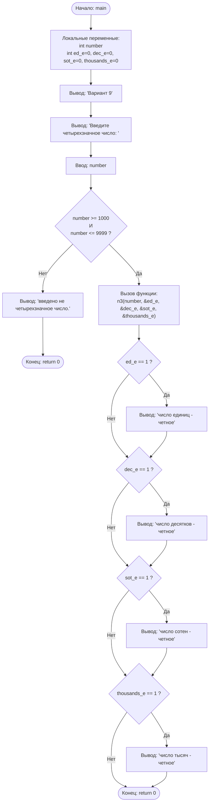
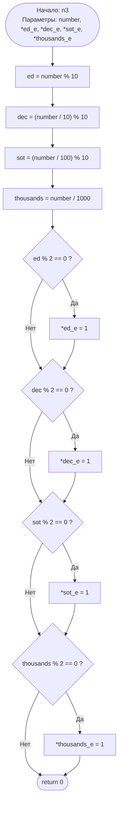

Блок схема функции main

```mermaid
flowchart TD
    Start([Начало: main]) --> Init[Локальные переменные:<br>int number<br>int ed_e=0, dec_e=0, sot_e=0, thousands_e=0]
    Init --> PrintVar["Вывод: 'Вариант 9'"]
    PrintVar --> PrintPrompt["Вывод: 'Введите четырехзначное число: '"]
    PrintPrompt --> Input[Ввод: number]
    
    Input --> CondValid{number >= 1000<br>И<br>number <= 9999 ?}
    
    CondValid -- Нет --> PrintError["Вывод: 'введено не четырехзначное число.'"]
    PrintError --> EndError([Конец: return 0])
    
    CondValid -- Да --> CallN3["Вызов функции:<br>n3(number, &ed_e, &dec_e, &sot_e, &thousands_e)"]
    
    CallN3 --> CondEd{ed_e == 1 ?}
    CondEd -- Да --> PrintEd["Вывод: 'число единиц - четное'"]
    CondEd -- Нет --> CondDec{dec_e == 1 ?}
    PrintEd --> CondDec
    
    CondDec -- Да --> PrintDec["Вывод: 'число десятков - четное'"]
    CondDec -- Нет --> CondSot{sot_e == 1 ?}
    PrintDec --> CondSot
    
    CondSot -- Да --> PrintSot["Вывод: 'число сотен - четное'"]
    CondSot -- Нет --> CondTh{thousands_e == 1 ?}
    PrintSot --> CondTh
    
    CondTh -- Да --> PrintTh["Вывод: 'число тысяч - четное'"]
    CondTh -- Нет --> EndSuccess([Конец: return 0])
    PrintTh --> EndSuccess
```

Блок схема функции дз

```mermaid
flowchart TD
    Start([Начало: n3<br>Параметры: number, *ed_e, *dec_e, *sot_e, *thousands_e]) --> CalcEd["ed = number % 10"]
    CalcEd --> CalcDec["dec = (number / 10) % 10"]
    CalcDec --> CalcSot["sot = (number / 100) % 10"]
    CalcSot --> CalcTh["thousands = number / 1000"]
    
    CalcTh --> Cond1{ed % 2 == 0 ?}
    Cond1 -- Да --> Act1["*ed_e = 1"]
    Cond1 -- Нет --> Cond2{dec % 2 == 0 ?}
    Act1 --> Cond2
    
    Cond2 -- Да --> Act2["*dec_e = 1"]
    Cond2 -- Нет --> Cond3{sot % 2 == 0 ?}
    Act2 --> Cond3
    
    Cond3 -- Да --> Act3["*sot_e = 1"]
    Cond3 -- Нет --> Cond4{thousands % 2 == 0 ?}
    Act3 --> Cond4
    
    Cond4 -- Да --> Act4["*thousands_e = 1"]
    Cond4 -- Нет --> Ret([return 0])
    Act4 --> Ret
```
